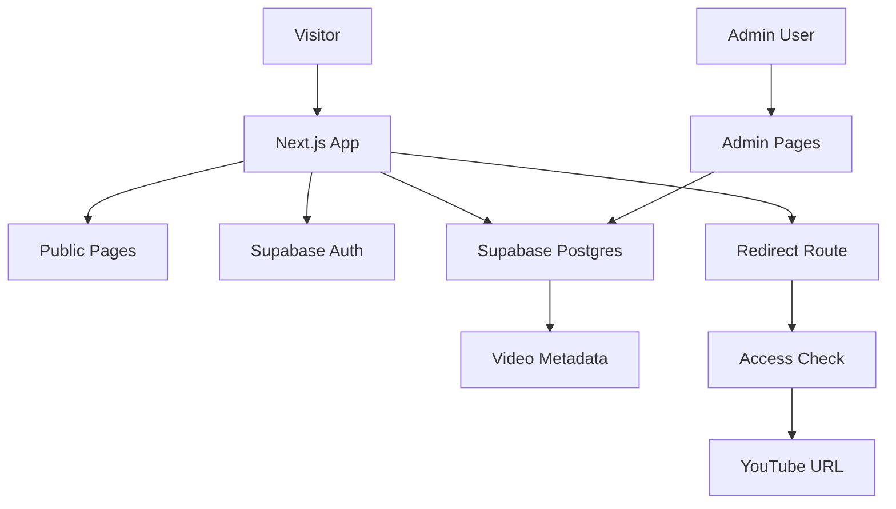
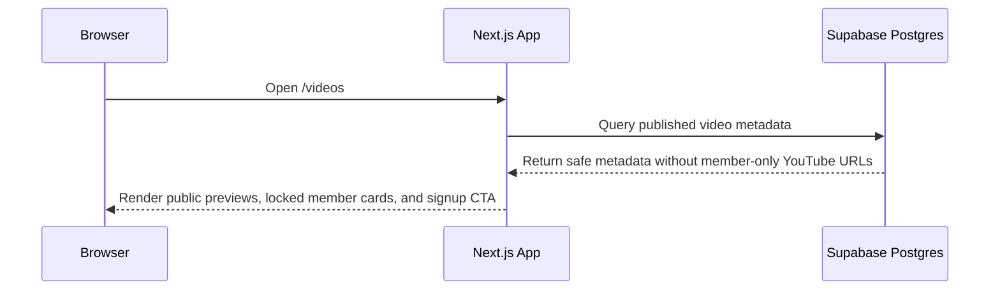
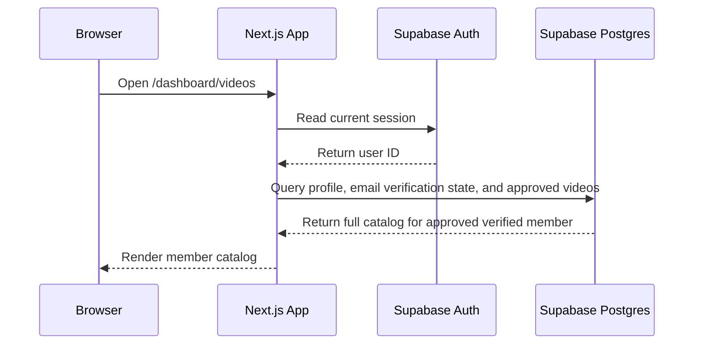
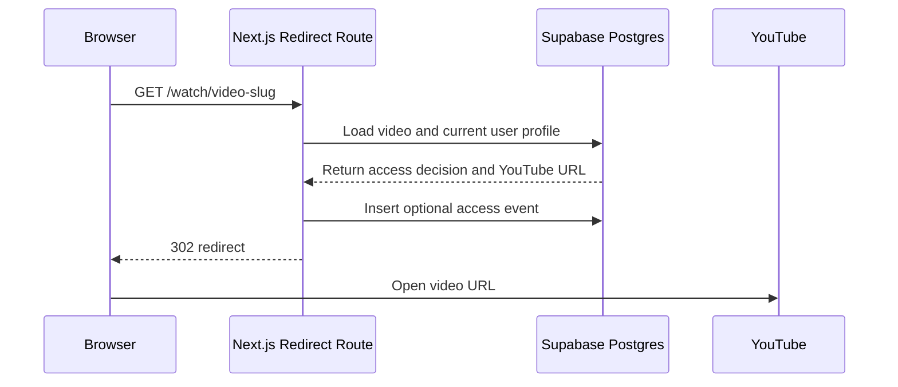
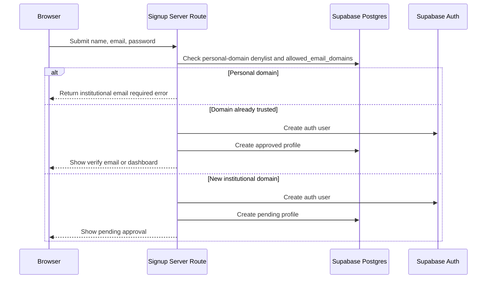

# Architecture

## Recommended Architecture

The site should be a single Next.js application deployed to Vercel, with Supabase providing authentication and Postgres storage. YouTube remains the video host.

This keeps the project simple:

- One web app repository.
- One hosted database and auth provider.
- No custom video streaming infrastructure.
- No separate backend server to maintain.

## System Components

| Component | Recommended Service | Responsibility |
| --- | --- | --- |
| Frontend | Next.js App Router | Pages, layouts, video catalog UI, auth forms, admin screens |
| Backend | Next.js Route Handlers and Server Actions | Signup validation, video access checks, YouTube redirect route, admin mutations |
| Authentication | Supabase Auth | Email/password accounts, sessions, password reset, email verification |
| Database | Supabase Postgres | Profiles, allowed domains, video metadata, categories, access events |
| Authorization | Supabase Row Level Security and server checks | Protect member-only rows and admin-only operations |
| Hosting | Vercel Hobby | Production deployment, preview URLs, environment variables |
| Video hosting | YouTube | Public or unlisted video playback destination |

## High-Level Flow



## Request Flow: Public Catalog



Public visitors can see locked member-only video titles, thumbnails, categories, and descriptions, but they should never receive member-only YouTube URLs or playable member-only redirect links in the HTML, API response, or client bundle. Since `youtube_url` is stored on the `videos` table, locked member-only metadata should be assembled by server-side code that strips sensitive fields before returning public catalog data.

## Request Flow: Member Catalog



The server should check authentication, membership status, and Supabase email verification. A signed-in user is not enough; the user must also have an approved profile and verified email before member access.

## Request Flow: YouTube Redirect



The redirect route is important because it centralizes authorization. Even if someone guesses a route, the server can deny access before sending the YouTube URL.

## Request Flow: Signup



The domain check must happen server-side. Client-side validation can improve the user experience but cannot be trusted for enforcement.

## Application Routes

Recommended routes for the first version:

| Route | Access | Purpose |
| --- | --- | --- |
| `/` | Public | Homepage and hero section |
| `/videos` | Public | Public previews and locked member-only teaser |
| `/about` | Public | Creator biography and mission |
| `/sign-up` | Public | Medical-affiliation signup form |
| `/sign-in` | Public | Login form |
| `/pending-approval` | Signed in | Explanation for users awaiting review |
| `/dashboard` | Approved members | Member landing page |
| `/dashboard/videos` | Approved members | Full video catalog |
| `/admin` | Admin only | Manage videos, categories, and allowed domains |
| `/watch/[slug]` | Public or member depending on video | Access-checking YouTube redirect |

## Data Ownership

The database is the source of truth for:

- Which videos are visible.
- Which videos are public or members only.
- Which users are approved members.
- Which email domains are trusted for automatic approval.
- Which users are administrators.

YouTube is the source of truth for:

- Actual video playback.
- Video comments and likes, if enabled.
- YouTube analytics.

The website can optionally store YouTube video IDs so it can build thumbnails such as:

```text
https://img.youtube.com/vi/{youtubeVideoId}/hqdefault.jpg
```

## Security Boundaries

The application should enforce access in three places:

1. Server routes and server actions check the current session, verified email, and profile status.
2. Supabase Row Level Security prevents unauthorized database reads.
3. Admin actions require an admin role in the profile table.

The browser should be treated as untrusted. Do not rely on hidden buttons or disabled links for protecting member-only videos.

## Deployment Boundary

Vercel should host the Next.js application. Supabase should host Auth and Postgres. Environment variables connect the two.

Vercel environment variables:

- `NEXT_PUBLIC_SUPABASE_URL`
- `NEXT_PUBLIC_SUPABASE_ANON_KEY`
- `SUPABASE_SERVICE_ROLE_KEY`
- `NEXT_PUBLIC_SITE_URL`

The service role key must only be used in server-only code. It must never be imported into client components.

## Why This Architecture Fits the Project

- It is affordable for a personal website.
- It avoids building a custom authentication system.
- It allows strict membership rules without heavy infrastructure.
- It keeps YouTube bandwidth and playback on YouTube.
- It leaves room for future features such as admin review, analytics, email notifications, and paid subscriptions.
