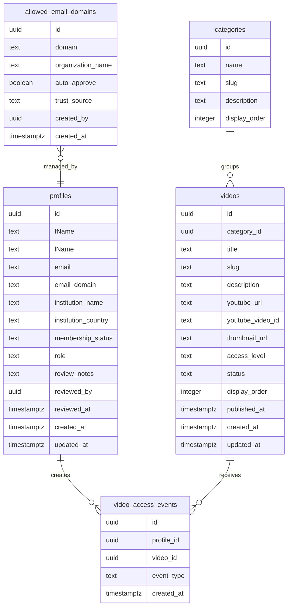

# Database Schema

## Database Choice

Use Supabase Postgres. It is a good fit because the site needs relational data:

- Users and profiles.
- Trusted medical email domains learned through admin approval.
- Video metadata.
- Categories.
- Access events.
- Admin permissions.

The site does not need a separate video storage database because YouTube hosts the actual videos.

## Entity Relationship Overview



## Required Extensions

```sql
create extension if not exists "pgcrypto";
```

## Profiles Table

Supabase Auth stores the actual auth user in `auth.users`. The public `profiles` table stores application-specific membership data.

```sql
create table public.profiles (
  id uuid primary key references auth.users(id) on delete cascade,
  "fName" text not null,
  "lName" text not null,
  email text not null unique,
  email_domain text not null,
  institution_name text not null,
  institution_country text not null,
  membership_status text not null default 'pending'
    check (membership_status in ('pending', 'approved', 'rejected')),
  role text not null default 'member'
    check (role in ('member', 'admin')),
  review_notes text,
  reviewed_by uuid references public.profiles(id) on delete set null,
  reviewed_at timestamptz,
  created_at timestamptz not null default now(),
  updated_at timestamptz not null default now()
);
```

`institution_name` and `institution_country` give admins enough context to review new institutional domains. `review_notes`, `reviewed_by`, and `reviewed_at` are optional admin-only fields for recording why a profile was approved or rejected.

Recommended indexes:

```sql
create index profiles_membership_status_idx on public.profiles (membership_status);
create index profiles_email_domain_idx on public.profiles (email_domain);
create index profiles_institution_country_idx on public.profiles (institution_country);
```

## Allowed Email Domains Table

This table is the trusted-domain dictionary. The app checks it during signup:

- Matching domain: create the profile as `approved`.
- New non-personal domain: create the profile as `pending`.
- Admin approval: optionally insert the approved user's domain into this table so future users from that domain are approved automatically.

```sql
create table public.allowed_email_domains (
  id uuid primary key default gen_random_uuid(),
  domain text not null unique,
  organization_name text not null,
  auto_approve boolean not null default true,
  trust_source text not null default 'admin_review'
    check (trust_source in ('admin_review', 'manual_seed', 'manual_admin')),
  notes text,
  created_by uuid references public.profiles(id) on delete set null,
  created_at timestamptz not null default now()
);
```

Example seed data:

```sql
insert into public.allowed_email_domains (domain, organization_name, auto_approve, trust_source)
values
  ('examplehospital.org', 'Example Hospital', true, 'manual_seed'),
  ('example.edu', 'Example University School of Medicine', true, 'manual_seed');
```

Only add real domains after verifying that they belong to medical institutions or health systems. For normal signups, the first user from a new institutional domain should remain pending until an admin approves the user and trusts the domain.

## Categories Table

```sql
create table public.categories (
  id uuid primary key default gen_random_uuid(),
  name text not null,
  slug text not null unique,
  description text,
  display_order integer not null default 0,
  created_at timestamptz not null default now(),
  updated_at timestamptz not null default now()
);
```

Example categories:

- Chest imaging.
- Neuroradiology.
- Emergency radiology.
- Musculoskeletal radiology.
- Board review.

## Videos Table

```sql
create table public.videos (
  id uuid primary key default gen_random_uuid(),
  category_id uuid references public.categories(id) on delete set null,
  title text not null,
  slug text not null unique,
  description text not null,
  youtube_url text not null,
  youtube_video_id text,
  thumbnail_url text,
  access_level text not null default 'members'
    check (access_level in ('public', 'members')),
  status text not null default 'draft'
    check (status in ('draft', 'published', 'archived')),
  display_order integer not null default 0,
  published_at timestamptz,
  created_at timestamptz not null default now(),
  updated_at timestamptz not null default now()
);
```

Recommended indexes:

```sql
create index videos_access_status_idx on public.videos (access_level, status);
create index videos_category_idx on public.videos (category_id);
create index videos_display_order_idx on public.videos (display_order);
```

Public preview videos should use:

```text
access_level = 'public'
status = 'published'
```

Member videos should use:

```text
access_level = 'members'
status = 'published'
```

## Video Access Events Table

This table is optional but useful for understanding which videos members click.

```sql
create table public.video_access_events (
  id uuid primary key default gen_random_uuid(),
  profile_id uuid references public.profiles(id) on delete cascade,
  video_id uuid references public.videos(id) on delete cascade,
  event_type text not null default 'redirect'
    check (event_type in ('redirect')),
  created_at timestamptz not null default now()
);
```

Recommended indexes:

```sql
create index video_access_events_profile_idx on public.video_access_events (profile_id);
create index video_access_events_video_idx on public.video_access_events (video_id);
create index video_access_events_created_at_idx on public.video_access_events (created_at);
```

## Helper Functions

### Current User Is Approved

```sql
create or replace function public.current_user_is_approved()
returns boolean
language sql
security definer
set search_path = public
stable
as $$
  select exists (
    select 1
    from public.profiles
    join auth.users on auth.users.id = profiles.id
    where profiles.id = auth.uid()
      and profiles.membership_status = 'approved'
      and auth.users.email_confirmed_at is not null
  );
$$;
```

This function intentionally requires both an approved profile and a verified Supabase Auth email. A user with `membership_status = 'approved'` should not receive member access until their email is confirmed.

### Current User Is Admin

```sql
create or replace function public.current_user_is_admin()
returns boolean
language sql
security definer
set search_path = public
stable
as $$
  select exists (
    select 1
    from public.profiles
    join auth.users on auth.users.id = profiles.id
    where profiles.id = auth.uid()
      and profiles.role = 'admin'
      and profiles.membership_status = 'approved'
      and auth.users.email_confirmed_at is not null
  );
$$;
```

## Row Level Security

Enable RLS on all application tables:

```sql
alter table public.profiles enable row level security;
alter table public.allowed_email_domains enable row level security;
alter table public.categories enable row level security;
alter table public.videos enable row level security;
alter table public.video_access_events enable row level security;
```

## Profiles Policies

Users can read their own profile. Admins can read all profiles.

```sql
create policy "profiles_select_self_or_admin"
on public.profiles
for select
using (
  id = auth.uid()
  or public.current_user_is_admin()
);
```

For version one, do not create a direct browser update policy on `profiles`. Users can read their own profile, but updates to `membership_status`, `role`, `institution_name`, `institution_country`, `review_notes`, `reviewed_by`, and `reviewed_at` should happen only through server-side code after explicit authorization.

Admin profile updates should use a server-side service role client after the route handler or server action verifies `requireAdmin()`. This prevents a member from changing their own approval state or role from the browser.

## Allowed Domains Policies

Approved users may read domain names if the UI needs them. Admins manage them.

```sql
create policy "allowed_domains_select_approved"
on public.allowed_email_domains
for select
using (public.current_user_is_approved());

create policy "allowed_domains_admin_all"
on public.allowed_email_domains
for all
using (public.current_user_is_admin())
with check (public.current_user_is_admin());
```

Signup domain checks should use server-side code. Do not expose the full allowlist publicly unless you are comfortable with users seeing it.

## Categories Policies

Public users can read categories only when they are used by published public videos. Approved users can read all categories.

```sql
create policy "categories_select_public_or_approved"
on public.categories
for select
using (
  public.current_user_is_approved()
  or exists (
    select 1
    from public.videos
    where videos.category_id = categories.id
      and videos.status = 'published'
      and videos.access_level = 'public'
  )
);
```

Admins can manage categories:

```sql
create policy "categories_admin_all"
on public.categories
for all
using (public.current_user_is_admin())
with check (public.current_user_is_admin());
```

## Videos Policies

Public users can read published public videos directly. Approved members can read all published videos. Admins can read and manage everything.

Because `youtube_url` is stored on the `videos` table, do not allow anonymous browser clients to directly select member-only rows from this table. Public locked-card metadata for member-only videos should be returned by a server route that selects only safe fields and omits `youtube_url`.

```sql
create policy "videos_select_public_or_approved"
on public.videos
for select
using (
  (
    status = 'published'
    and access_level = 'public'
  )
  or (
    status = 'published'
    and public.current_user_is_approved()
  )
  or public.current_user_is_admin()
);

create policy "videos_admin_all"
on public.videos
for all
using (public.current_user_is_admin())
with check (public.current_user_is_admin());
```

## Access Event Policies

Users can insert their own access events. Admins can read all events.

```sql
create policy "video_access_events_insert_self"
on public.video_access_events
for insert
with check (profile_id = auth.uid());

create policy "video_access_events_select_self_or_admin"
on public.video_access_events
for select
using (
  profile_id = auth.uid()
  or public.current_user_is_admin()
);
```

## Data Validation Rules

Application code should validate:

- `youtube_url` starts with `https://www.youtube.com/` or `https://youtu.be/`.
- `slug` is lowercase and URL-safe.
- `access_level` is either `public` or `members`.
- `status` is `draft`, `published`, or `archived`.
- Only 2 or 3 videos should be marked public for the public preview section.
- Public locked-card responses for member-only videos include safe metadata only: title, slug, description, category, thumbnail, access level, and locked state.
- Member access requires both `membership_status = 'approved'` and a verified Supabase Auth email.
- Profile approval, rejection, role changes, and review notes are admin/server-only operations.

The database should protect critical invariants, but the admin UI should still validate early and show friendly messages.

## Backup and Portability

Supabase Postgres can be exported later if the project grows. Since the website stores only metadata and not video files, the data remains small and portable.
